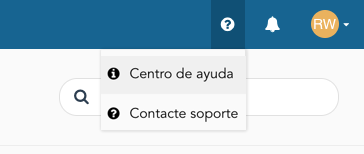
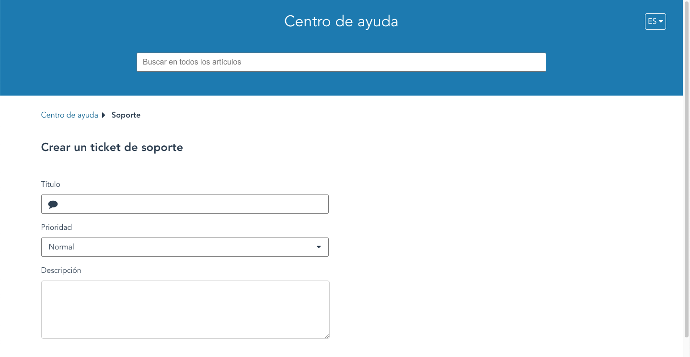

¿No pudiste encontrar lo que buscabas en estos artículos de ayuda o tuviste un inconveniente? Asegúrate de informarnos y podemos ayudarte con tu solicitud. Simplemente vete al menú del *Centro de ayuda* en la parte superior de la página y haz clic en *Contactar al soporte*:

Te dirigirá a una nueva pestaña donde puedes abrir un ticket de soporte:

Provee una breve descripción del problema en el campo llamado **Título**, el nivel de impacto de su servicio en el campo **Prioridad** y en el campo **Descripción** un resumen claro del problema también como el resultado deseado. Nuestro equipo de soporte te dará una respuesta lo antes posible.
